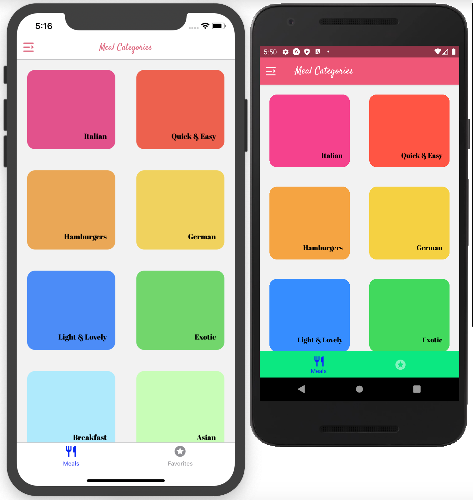

# MEALS APP
#### React Native App

## DEMO

## Technologies are used in this App:
 - JavaScript
 - React Native

 ## INSTALL 
    $ git clone https://github.com/MostafaIn/MEALS-RNApp.git
    $ cd MEALS-RNApp
    $ npm install

## Start & watch
    $ expo start

### Done By
- Mostafa Hazareh (http://mostafaportfolio.netlify.com)